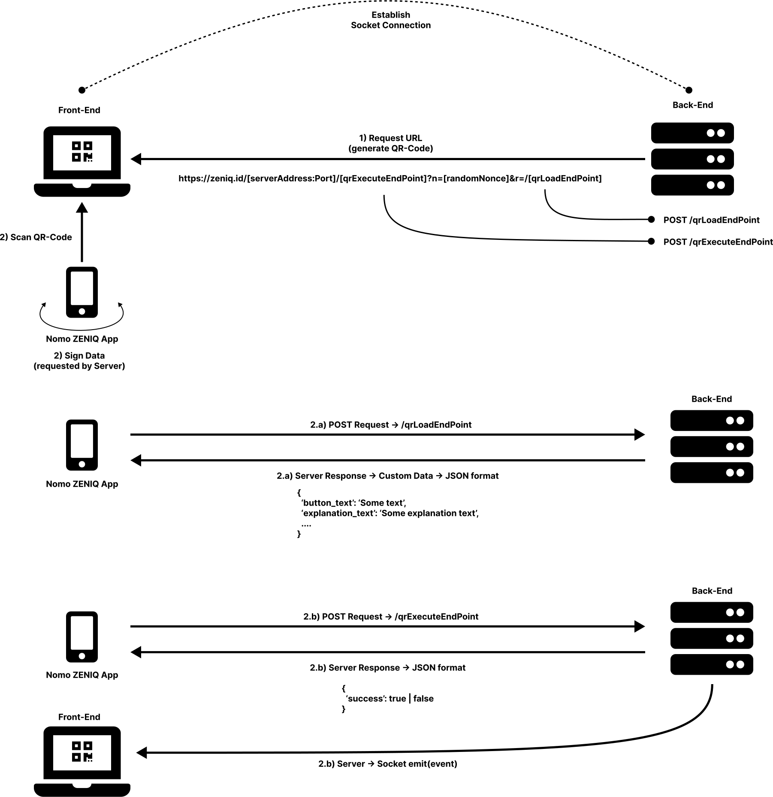

# Deprecation Notice

This package is deprecated because it has been superseded by https://github.com/nomo-app/nomo-id.
Please upgrade your application to nomo-id if you are still using this package!

# Overview

This library is designed for developers to integrate the [Nomo ZENIQ mobile app](https://play.google.com/store/apps/details?id=com.zeniq.app&hl=en&gl=US) into their applications. The mobile app uses the ZENIQ ID System Protocol. This protocol specifies how developers can interact with the mobile app. This documentation will first explain the core concept of the ZENIQ ID System Protocol. Afterwards we will explain the general workflow for integrating the mobile app into your application.

## ZENIQ ID System Protocol

The protocol consists of two parts:
- Server
- Client

The server creates and presents a QR-Code for the client. The QR-Code contains a certain URL scheme called **Request-URL**. The mobile app (client) will be asked to sign requested information within the Request-URL. After signing, the mobile app sends back the requested information to the server via a HTTP request.

### Request-URL
The Request-URL contains all the information needed by the mobile app. This includes:
- Back-End location
- Loading Endpoint
- Execute Endpoint
- Parameters

**Back-End location:** The server address where the back-end is hosted. The backend needs to provide endpoints for the mobile app. The mobile app sends the signed data to the provided endpoints

**Loading Endpoint:** This endpoint shall be used and implemented by the developer to inform the user about the data to be signed. This information will be displayed to the user before signing the requested data. The Execution Endpoint will be called when the user accepts the signing request

**Execution Endpoint:** The mobile app is sending the signed data to this endpoint. The signed data can be used by the developer for further implementation

**Parameters:** The data that can be retrieved from the mobile app:
- Wallet address
- ETH address
- BTC address
- Device hashes
- and more ...

**Note:** The mobile app is constantly updating. More options will become available for developers.

## Workflow

The following graphic shows the workflow for integrating the Nomo ZENIQ mobile app into your application. We will explain the following workflow with a real use case. Assume you want a user to log into your website using the Nomo ZENIQ mobile app. You can read more about Web3 authentication [here](https://www.leewayhertz.com/how-does-authentication-authorization-work-in-web3/). To achieve this, you will need to map a users wallet address to his account data. For this, a QR-Code should be provided where a user can *link his device*. To link a device a user must first scan a provided QR-Code (contains Request-URL) and sign the requested data. This can be seen as the first step in the figure. The developer is responsible for creating the valid Request-URL in the back-end. The QR-Code will be displayed in the front-end and must be scanned with the Nomo ZENIQ mobile app. The next step is to inform the user about the data to be signed. The implementation will be within the *qrLoadEndPoint*. The library provides the required and optional fields that can be used. When a user signs the requested data, the *qrExecuteEndPoint* will be called. The requested data is available for further implementation. In our use case, the implementation for the device linking needs to be implemented here. The *qrLoadEndPoint* shall update the mobile app about the success or failure. The library provides the required and optional fields that can be used. In our scenario, the last step shows the update on the mobile app as well as the front-end about the status.
 
 

 
 
 

# ZENIQ-ID Library
The library supports developer setting up the described workflow. The library provides interfaces for the *qrExecuteMethod* as well as the *qrLoadMethod* and the required return types. The core of the library is the *authorize()* method. This method performs security checks on the implemented *qrExecute* and *qrLoad* methods and returns the two methods able to be invoked within the back-end endpoints.
Additionaly the library provides a mapping for sockets (if used) and the *nonce* parameter from the Request-URL.

**Note:** The library will be further implemented in the future!
